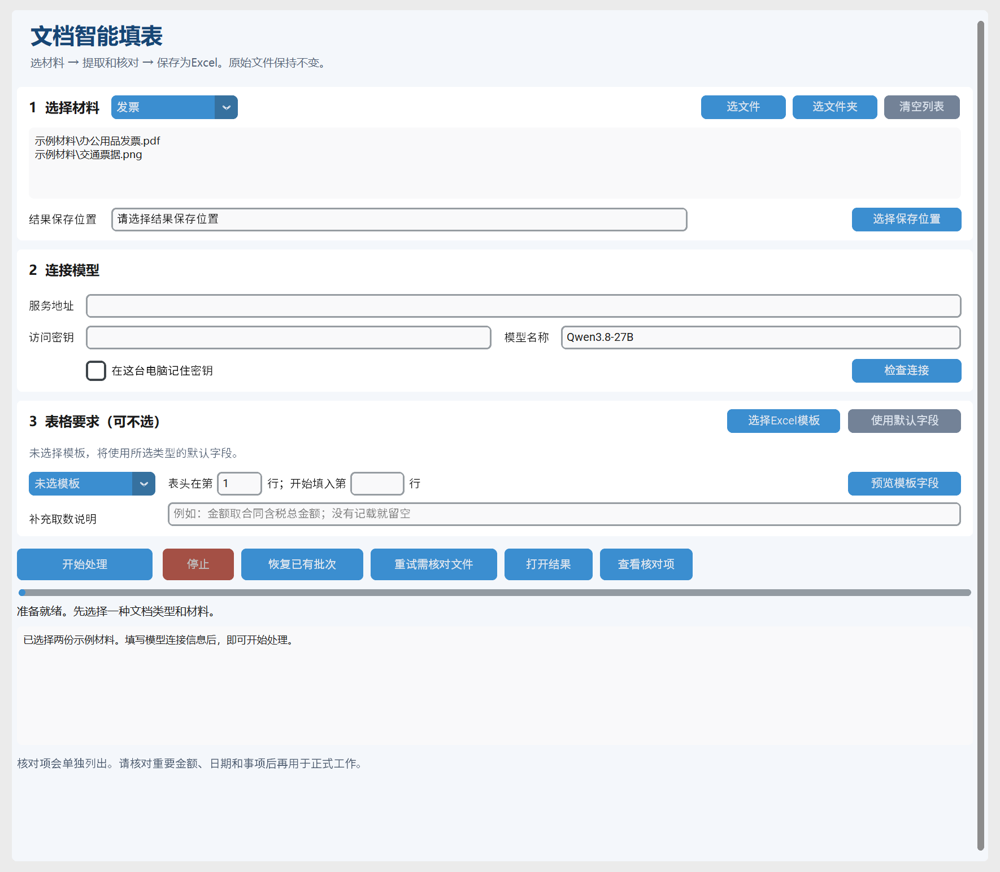

# 🧾 文档智能填表系统

把 Word、图片和 PDF 中的发票、会计凭证、合同或会议纪要整理成 Excel。通过 Windows 窗口选择材料、填写模型连接信息、查看结果，全程不需要编写程序。

程序会保留来源位置，把需要确认的内容放入“需人工核对”工作表。原始材料和模板保持不变，生成的结果另存为新文件。

**当前版本通过81项软件检查，并使用实际模型服务完成四类合成材料联调。真实业务样本的质量验收留待后续，尚不能据此宣称真实识别准确率或处理速度达标。**

## 📋 能做什么

每次选择一种文档类型，可以一次加入多个文件，或者选择整个材料文件夹。

| 选择的类型 | Excel 中一行代表什么 | 需要注意的对应关系 |
|---|---|---|
| 发票 | 一张独立票据 | 同一页有多张票时分别列出；商品、数量、单价、金额等明细在同一格内逐项换行。 |
| 会计凭证 | 一条会计分录 | 同一凭证的核算单位、字号和日期等信息重复填写，分录按原顺序排列；附件作为佐证材料。 |
| 合同 | 一份独立合同 | 分期付款的条件、比例或金额、期限逐项对应；没有明确总金额时留空，不把分期金额自行相加。 |
| 会议纪要 | 一项待办；没有待办时是一项议题 | 多项待办分别列出，分别对应责任人和截止日期；原文没有指定的内容留空。 |

例如，一张凭证有“借原材料 100、借应交税费 13、贷应付账款 113”，结果为三行，不另加一行汇总。同一议题安排两个人各做一件事，结果为两行；只有决议、没有待办的议题也会保留。

默认字段包括票据信息与金额、凭证科目与借贷金额、合同主体与付款安排、会议议题与责任人等。也可以选择自己的 Excel 模板，按照模板表头取数。

## 🧰 使用前准备

准备以下材料即可：

- 一台 Windows 电脑，以及下文说明的 Python 3.14 运行环境。
- 待处理的 Word、PDF 或图片。Word 支持 .docx 和旧格式 .doc；图片支持 .png、.jpg、.jpeg、.tif、.tiff，包括多页图片。
- 服务提供方给出的**服务地址、访问密钥、模型名称**。所选服务需要能接收文字和图片，并支持本程序的提取要求。
- 一个保存结果的文件夹；如有固定表样，再准备普通 .xlsx 模板。

旧格式 .doc 需要电脑已经安装且能正常打开 Microsoft Word。普通 .docx、PDF 和图片读取不依赖 Word。结果可以用 Excel 打开。

模型由你填写的服务提供，程序会把选中材料的文字或图片发送到该服务进行提取。电脑上安装的是本程序运行组件，无需另行下载大型模型。服务是否收费、如何计算用量，以服务提供方的说明为准。

## 🚀 第一次使用

### 1. 把程序完整解压到一个文件夹

在 GitHub 项目页面下载完整压缩包，右键选择“全部解压”。打开解压后的文件夹，应能看到“启动程序.bat”“安装依赖.bat”和本说明。

请在解压后的文件夹中启动，保持其中的文件和子文件夹完整。首版提供这种启动方式，尚未提供单独的安装包。

### 2. 安装 Python 3.14

打开 [Python 官方 Windows 下载页](https://www.python.org/downloads/windows/)，找到 **Python 3.14 系列的正式版本**，选择“Windows installer (64-bit)”这一项，即适用于常见 64 位电脑的完整安装程序。

下载后双击安装文件，选择“Install Now（立即安装）”，保留**默认的当前用户安装位置**。本程序的启动文件按照这一位置寻找 Python 3.14。安装步骤可参照 [Python 官方完整安装程序说明](https://docs.python.org/3.14/using/windows.html#the-full-installer-deprecated)。

如果已经按上述方式安装过 Python 3.14，可直接进行下一步。电脑里装有其他版本时，也可以保留，本程序会使用指定的 3.14 版本。

### 3. 安装程序所需组件

回到程序文件夹，双击“安装依赖.bat”。首次安装需要联网，会弹出显示安装进度的窗口。

看到“安装完成”后，按窗口提示关闭，再双击“启动程序.bat”。如果显示安装未完成，保留窗口中的错误信息，按后面的常见问题处理。

**以后平时使用，只需双击“启动程序.bat”。** 不需要每次重复安装组件。首次运行后，本机连接设置和批次进度会保存在程序自己的工作文件夹中。

## 🖱️ 窗口里怎么操作

### 第一区：选择材料

1. 在文档类型下拉框选择“发票”“会计凭证”“合同”或“会议纪要”。一批只选一种业务类型。
2. 点击“选文件”加入一个或多个文件，也可以点击“选文件夹”加入材料目录，其中的子文件夹会一起查找。
3. 查看材料列表。选错了可以点击“清空列表”后重新选择，这只清空窗口列表，不会删除文件。
4. 点击“选择保存位置”，选一个专门放结果的文件夹。默认位置是程序文件夹里的“结果”。

建议把原始材料和结果分别放在不同文件夹。程序会跳过自己的工作目录；已有 Excel 结果不属于输入材料，不会再次提取。同一路径的重复选择会合并；内容完全相同的文件也会合并，并在下方记录中提示。

### 第二区：连接模型

依次填写服务地址、访问密钥、模型名称。**服务地址请填写服务提供方给出的地址**；模型名称也以服务提供方提供的名称为准，窗口里已有的名称可以修改。

点击“检查连接”，等待下方出现连接结果。这个按钮会用一小段文字示例检查服务能否返回可读取的结果。通过后，可以先用少量材料开始处理，确认所选服务也能识别你的图片和业务内容。

“在这台电脑记住密钥”由你选择。未勾选时，密钥不会作为下次启动的设置保存；勾选后会保存在这台电脑的本机设置中。服务地址和模型名称会随开始或恢复处理时保存，公开项目不附带可直接使用的私人连接信息。

### 第三区：表格要求

没有固定表样时，保持“未选择模板”，程序会使用所选业务类型的默认字段。

有自己的表样时，点击“选择Excel模板”，按下一节设置工作表、表头行和开始填写行，再点击“预览模板字段”。想改回默认字段，点击“使用默认字段”。

“补充取数说明”可以填写具体要求，例如“金额取合同含税总金额；原文没有记载就留空”“付款条件请按阶段分别列出”。说明用于表达取数口径，不应要求程序编造缺失信息。

### 开始、查看进度和打开结果

点击“开始处理”后，下方会显示读取、提取、保存、导出等进度。处理期间窗口仍可查看，开始按钮会暂时停用，避免重复开始同一任务。

结束后查看正常行数、需核对行数，以及是否显示“结果已导出”。点击“打开结果”打开 Excel；点击“查看核对项”查看来源文件、位置和需要核对的原因。

“处理结束”表示本次运行已经结束。是否存在未完成文件、是否已经导出 Excel，要结合下方说明和核对清单确认。

## 📐 自己的 Excel 模板怎样准备

模板使用普通 .xlsx 文件，一次选择其中一个业务工作表。其他说明工作表可以保留。

- **工作表**：选择实际需要填写数据的那一张表。
- **表头在第几行**：填写字段名称所在的行号。例如第 1 行是大标题、第 3 行是“合同名称、甲方、金额”，这里填写 3。
- **开始填入第几行**：填写第一条新记录应放入的行号。该位置以及本次写入范围必须为空，不能覆盖已有数据或公式。
- **开始行留空**：程序自动选择已有内容之后的位置。模板如果给很远的空白行设置过格式，自动位置可能偏后；可以先在 Excel 中确认空白区域，再明确填写开始行。
- **预览模板字段**：检查字段名称和开始行是否正确。程序会按字段原来的列位置填写，表头之间存在空列也不会把后面的数据挤到前面。

可以保留表头上方的合并标题、已有样例、列宽和常见格式。原有数据继续保留，结果写入空白区域；来源信息另附在业务字段右侧。右侧需要留出空白，避免与另一张表混在一起。

首版要求**单行表头，字段名称非空且不重复，表头和数据区不合并单元格**。模板业务字段请勿与程序附加的“来源文件、来源位置、单据/事项序号、取数说明、核对原因”重名。

含图形、图表、控件、宏、外部对象，多级合并表头，或多个业务区域混排的复杂模板，可能被提示不支持。按照提示整理成一个普通矩形表格后再选择。模板已有公式会保留，但程序不会替你扩展公式范围或计算公式，填写区域有公式时会停止导出。

## 📊 结果表怎么看

不选模板时，结果工作簿中包含“提取结果”和“需人工核对”。选择模板时，正常结果写在选定的业务工作表，另外增加核对工作表；如原模板已有同名核对表，新表名称会加上序号。

**业务工作表放正常结果，核对工作表放需要确认的结果。** 查看本批次全部内容时，两张表都要看；模板原来已有的数据不计入程序显示的本批次新增行数。

每条结果附带来源文件、来源位置、单据或事项序号和取数说明。PDF 和图片按页定位；Word 按段落、表格行列、页眉页脚等位置定位，不编造 Word 页码。

“需人工核对”会说明具体原因，例如关键字段无法辨认、金额关系不符、同一凭证信息冲突、图片区域未能读取、服务回答不完整。整份文件打不开时，也会留下一条带文件名和原因的记录。该记录不代表已经识别出一张票或一条分录。

数字和空白按以下原则处理：

- 原文的零保留为零，负数保留负号；空白不会自动改成零。
- 原文没有记载的内容允许留空，并按适用情况说明原因。“没有记载”和“看不清楚”会分别处理。
- 发票号码、纳税人识别号、合同编号等按文本写入，保留前导零和长编号。
- 金额、币种、金额单位分别记录，不自动换算币种，也不把“万元”当成“元”。
- 凭证按同一凭证、同币种和同单位检查借贷关系，不为使借贷平衡而补造分录。
- 文字或数值超过 Excel 能可靠保存的容量时，会停止导出并说明原因，不静默截断或舍入。

可以在生成的 Excel 中进行人工复核和整理。之后再次从程序导出时，会生成独立的新结果文件，不会把你在旧 Excel 中的修改自动带回批次记录。每次以“打开结果”指向的本次结果为准，历史结果继续保留。

## ⏸️ 停止、恢复和重试

### 暂时停下来

点击“停止”，程序会停止安排后续提取，已经保存的结果保留。已经发往模型服务的请求可能仍在收尾，窗口会显示当前情况；停止本机后续处理不等于服务端一定已经取消计算。

等待状态更新后再关闭窗口。尚未完成的批次可以通过“恢复已有批次”继续。整个过程的进度保存在本机批次文件夹里，Excel 是根据已保存结果生成的文件。

### 找回已有批次

1. 重新双击“启动程序.bat”，确认服务地址、访问密钥和模型名称。
2. 点击“恢复已有批次”。选择窗口默认会打开程序自己的批次目录。
3. 找到对应日期和时间开头的文件夹，选中这个批次文件夹后确认。
4. 查看恢复后的材料列表和处理说明，完成后再打开当前结果。

需要在资源管理器里寻找时，先打开程序所在文件夹，再依次打开“.local”和“批次”。其中每个按日期时间命名的子文件夹对应一次新批次。若看不到相关文件夹，Windows 11 可在“查看 → 显示”里勾选“隐藏的项目”；Windows 10 可在“查看”选项卡勾选“隐藏的项目”。选择的是具体批次文件夹，不是原材料目录，也不是结果 Excel 所在目录。

保留批次文件夹以及对应原始材料。只要服务地址、模型、类型、模板和取数要求仍与原批次一致，单独更新访问密钥后可以恢复。**修改源材料内容，或更换服务、模型、模板、取数口径时，应点击“开始处理”建立新批次**，避免把不同条件下的结果混在一起。

### 只重试需要核对的文件

本次结束后点击“重试需核对文件”；重启程序后，先恢复对应批次，再点击这个按钮。

重试以文件为范围。如果一份长合同里有一项需要核对，程序会重新处理这份合同，以保留上下文；同批其他已完成且正常的文件不会重新询问模型。重试结果替换该文件原来的提取结果，再生成新的 Excel，不向旧表末尾重复追加。

## 🔄 程序内部怎样处理材料

程序先检查材料类型和重复文件，再按原文位置读取。Word 的正文和表格依原顺序处理，同时读取内嵌图片、页眉和页脚；旧格式 Word 在工作副本上转换。PDF 逐页生成图像，多页图片逐页读取，大图分区域保留细节。

较长的材料会拆成有限大小的片段，相邻片段尽量保留上下文。程序同时最多进行两路模型提取；合同和纪要会按较复杂的材料组织提取要求。模型返回候选字段后，程序检查回答是否完整、来源位置是否存在，再检查关键金额和业务对应关系。

可确认的结果和需核对的原因一起保存到本机。遇到暂时网络故障或服务繁忙，会进行有限次数的自动重试；密钥、地址或模型配置错误会提示暂停检查。无法确认的内容会保留原因，不因为模型已经返回文字就算作正常结果。

最后根据当前保存的整批结果生成 Excel，并重新读取检查生成文件。导出失败不会撤销之前保存的提取进度，解决文件占用或目录问题后，可以恢复批次再次导出。

## 🛠️ 常见问题

| 看到的情况 | 怎么处理 |
|---|---|
| 提示找不到 Python 3.14 | 按“第一次使用”安装官方 3.14 完整安装程序，保持默认的当前用户安装位置，然后重新双击启动文件。 |
| 提示缺少运行组件 | 双击“安装依赖.bat”，确认看到安装完成；安装失败时保留窗口中的错误信息，检查网络后再试。 |
| 提示程序已经打开 | 回到已经打开的窗口继续使用，程序会避免同一 Windows 会话重复启动。 |
| 连接失败或访问被拒绝 | 核对服务提供方给出的地址、密钥和模型名称，检查电脑是否能访问该服务；修正后检查连接。 |
| 连接检查成功，图片仍处理失败 | 连接检查使用文字示例。请向服务提供方确认该模型支持图片及本程序的提取要求，再用一份清晰图片验证。 |
| 服务繁忙、等待较久 | 查看下方进度和报错。自动重试仍失败时，稍后恢复批次；不要反复新建相同批次。 |
| 没有找到可处理文件 | 确认选中受支持的材料，检查文件是否位于被排除的程序工作目录。 |
| 某份 Word、PDF 或图片打不开 | 先用日常软件打开原件，检查损坏、加密或内容异常；旧格式 Word 还需要本机 Word 能正常启动。 |
| 提示模板表头或开始行不对 | 打开 Excel 确认字段所在行和空白填写区域，在窗口修正行号并重新预览。 |
| 提示模板结构不支持 | 按提示移除或另存不受支持的结构，使用普通单行表头表格；原模板不会被覆盖。 |
| 有结果记录，但 Excel 尚未导出 | 查看具体原因，关闭占用结果的窗口，检查保存位置和模板填写区。恢复批次可重新导出已保存内容。 |
| 停止后还显示请求正在收尾 | 已停止安排后续处理，等待状态更新。服务端是否停止计算，需要以服务实际行为为准。 |
| 显示需人工核对或某些字段为空 | 打开核对表，对照来源位置确认原因。原文缺失不必补造；确有识别问题可重试该文件或人工填写结果副本。 |
| 恢复时提示配置不一致 | 使用原批次的服务、模型、模板和取数要求；需要改变这些条件时建立新批次。 |

反馈问题时，说明当时选择的业务类型、进行到哪一步，并附上窗口错误文字。涉及识别差异时，可以提供便于复现的脱敏样例和期望结果。

## ✅ 当前验证范围

软件测试和合成示例联调覆盖了文档读取、模型返回处理、保存与恢复、模板导出等环节，包括原件保持不变、长文切段、异常结果转核对等行为。具体执行记录以[验收记录](docs/reviews/2026-09-08-验收记录.md)为准。

本阶段暂不提供真实业务资料。原计划的 **40 份真实业务样本，每类 10 份**，以及实际服务下的识别质量、漏项情况、处理耗时，均保留为后续待测项目。合成示例验证的是程序处理过程，不能替代对真实发票、凭证、合同和纪要的质量验收。

## 📄 开源协议

本项目采用 [AGPL-3.0 开源许可证](LICENSE)（仅第三版），即第三版 Affero 通用公共许可证。使用、修改和分发本项目时，请遵守许可证全文；引用组件继续遵守各自的许可证。